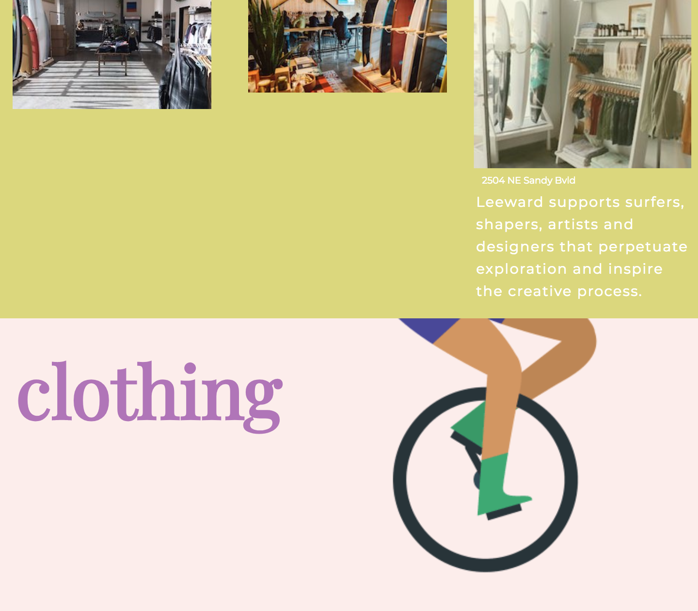
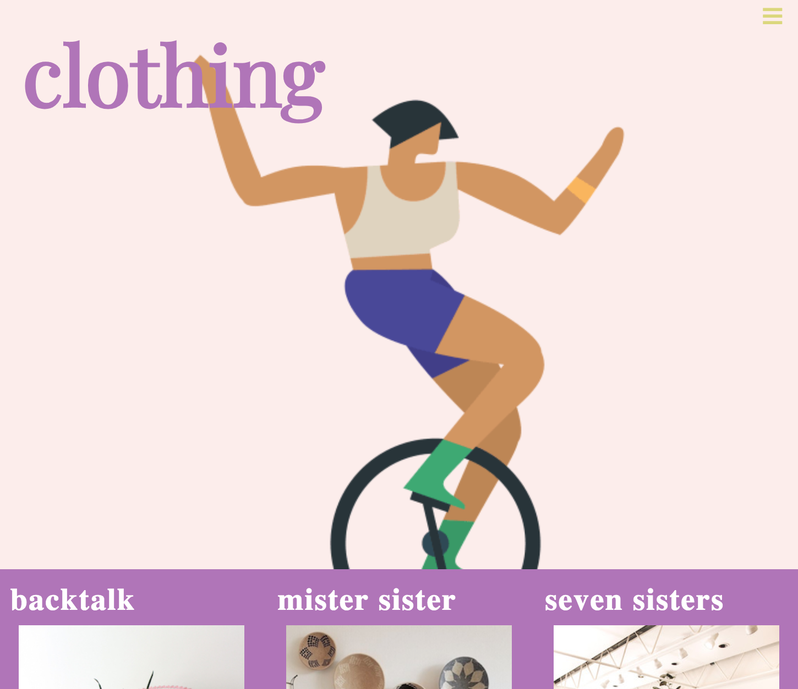

# _
Bloc - home for local businesses in PDX
_

#### _**
By: Julia Sheremet and Jessica Schmitz
**_

  

### See this live at: https://juliajessica.github.io/bloc/

Bloc is a webpage designed to share creative design inspirations by Julia Sheremet and Jessica Schmitz. The idea for bloc was created to help local businesses thrive. We developed a single page application where PDX businesses can share their shop information and gain an extra backlink to their site.  

| Application Homepage | Application Color Scheme |
| :------------- | :------------- |
|  |  |

## Parallax Scrolling Between Business Descriptions
| First Business | Introduction to Clothing | List of Businesses |
| :------------- | :------------- | :------------- |
|  |   |  |

# Setup Requirements
* Clone this repository
* Run npm install to install all dependencies
* Run npm run start to build and start the development environment

# Technologies
* HTML
* CSS
* Webpack

### License

Copyright (c) 2018 **Julia Sheremet & Jessica Schmitz** 

Permission is hereby granted, free of charge, to any person obtaining a copy of this software and associated documentation files (the "Software"), to deal in the Software without restriction, including without limitation the rights to use, copy, modify, merge, publish, distribute, sublicense, and/or sell copies of the Software, and to permit persons to whom the Software is furnished to do so, subject to the following conditions:

The above copyright notice and this permission notice shall be included in all copies or substantial portions of the Software.
