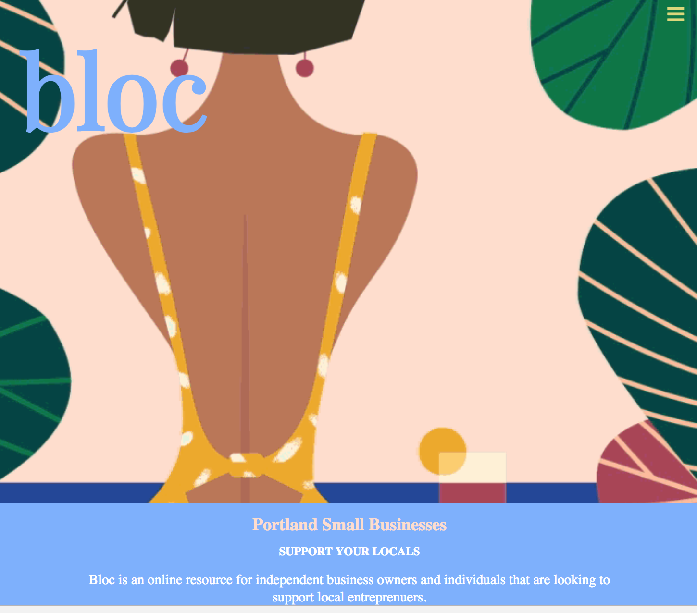

# Bloc

### See this live at: https://juliajessica.github.io/bloc/

Bloc is a webpage designed to share creative design inspirations by Julia Sheremet and Jessica Schmitz. The idea for bloc was curated to help local businesses thrive. We developed a single page application where PDX businesses can share their shop information and gain an extra backlink to their site.  

| Application Homepage | Application Color Scheme |
| :------------- | :------------- |
|  |  |

## Parallax Scrolling Between Business Descriptions
| First Business | Introduction to Clothing | List of Businesses |
| :------------- | :------------- | :------------- |
|  |   |  |

# Setup Requirements
* Clone this repository
* Run npm install to install all dependencies
* Run npm run start to build and start the development environment

# Technologies
* HTML
* CSS
* Webpack

This project uses the _MIT License_
&copy; **Julia Sheremet & Jessica Schmitz** 2018
